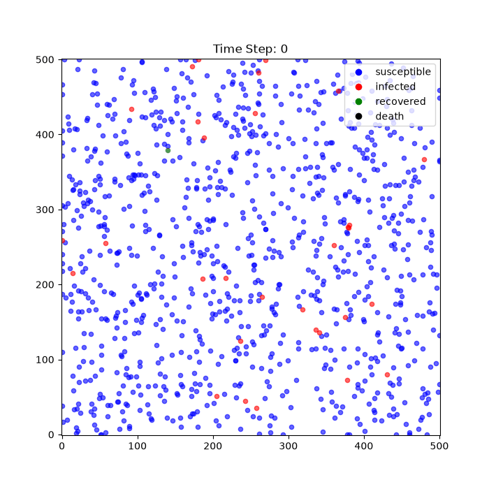
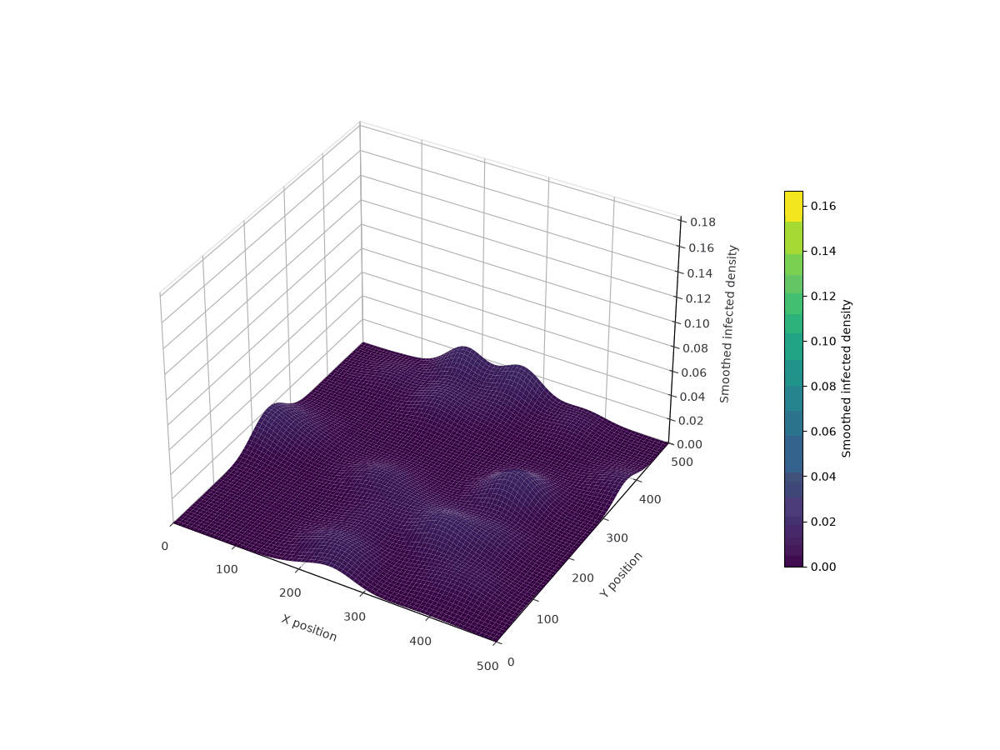

# Epidemic Simulation Benchmark

Research code for comparing an Esper Entity Component System epidemic model
with a Mesa agent-based implementation.

This is an independent exploration of whether a data-oriented ECS architecture
can express a nontrivial spatial epidemic model and provide a useful basis for
a controlled comparison with a conventional object-oriented agent-based model.

## Current Status

The ECS prototype is implemented and runnable. The Mesa model and the
cross-implementation benchmark are planned work and are not runnable yet.

The project currently demonstrates:

- Mobile agents in a bounded two-dimensional space
- Spatial transmission based on distance and susceptibility
- Weighted contact-network transmission
- Random and spatial-age homophily networks
- Dynamic network rewiring
- Infection-hazard accumulation and resolution
- Disease progression, recovery, and death
- Optional quarantine with mobility and transmission effects
- Reproducible, model-owned random streams
- Temporal and spatial result collection

## Layout

- `src/epidemic_sim/ecs`: implemented Esper model, components, and systems
- `src/epidemic_sim/mesa`: Mesa implementation area
- `src/epidemic_sim/networks`: shared network utilities
- `src/epidemic_sim/data`: data-related package code
- `src/epidemic_sim/analysis`: analysis and visualization package code
- `scripts`: executable ECS and data-generation scripts, plus planned Mesa and benchmark entry points
- `experiments`: exploratory modeling workflows
- `data`: raw, processed, and generated datasets
- `results` and `project_outputs`: generated artifacts

## Installation

The project uses uv for environment and dependency management:

```bash
uv sync
uv run python -c "from epidemic_sim.ecs.simulation import SIREpidemicModel; print('Package import: OK')"
```

## Running the ECS Model

Run the implemented ECS simulation with:

```bash
uv run python scripts/run_ecs.py
```

The runner uses a 1,000-agent illustrative configuration and saves generated
figures in the current working directory. To keep outputs together, run it
from `project_outputs`:

```bash
cd project_outputs
uv run python ../scripts/run_ecs.py
```

The ECS workflow produces epidemic curves, a spatial-agent animation, a spatial
heatmap, and an infected-density 3D wave using the `viridis` colormap.

Example visual outputs:





The synthetic-data script expects its source CSV files under `data/raw`:

```bash
uv run python scripts/generate_data.py
```

The synthetic-data workflow additionally requires SDV, which is kept outside
the core dependencies because its current releases do not resolve for Python
3.12.

## Planned Mesa Benchmark

The following entry points are reserved for future work:

```bash
uv run python scripts/run_mesa.py
uv run python scripts/run_benchmark.py
```

They currently report that the Mesa implementation and cross-implementation
benchmark are not available yet. The planned benchmark will compare equivalent
model semantics across ECS and Mesa, including runtime scaling, memory use,
reproducibility, and the effort required to add new mechanisms.

## Contributing

Contributions are welcome, especially in these areas:

- Implementing the Mesa parity model
- Validating ECS and Mesa state-transition equivalence
- Designing reproducible benchmark experiments
- Profiling runtime and memory scaling
- Adding tests for seeded reproducibility and world isolation
- Implementing extensions such as vaccination or new health compartments
- Improving documentation and scientific reproducibility

Please keep comparisons fair: ECS and Mesa implementations should use the same
parameters, mechanisms, output definitions, and comparable algorithms.

## License

This project is released under the Apache License 2.0. See [LICENSE](LICENSE)
for the complete terms.